# 🔰ClosedXMLをPowershellから触ってみる

## 🔰ClosedXMLの公式サイト

- [github - ClosedXML](https://github.com/ClosedXML/ClosedXML)

## 🔰ClosedXMLとは

Microsoft officeはバージョン2007からMicrosoft独自規格(doc,xls,ppt)からOpenXML(docx,xlsx,pptx)に移行した。

このOpenXMLなドキュメントを取り扱うSDKをマイクロソフトはOpenXml-SDKとしてOSSで公開している。

- [github - Open-XML-SDK](https://github.com/OfficeDev/Open-XML-SDK)

OpenXml-SDKを使用してxmlxファイルを取り扱っても良いが、なかなかとっつき辛い所があり。
そんなOpenXml-SDKを簡易に扱えるようにラッピングしたライブラリがClosedXMlとなっている。

## 🔰ClosedXMLの環境構築

- [Nuget - OpenXML-SDK](https://www.nuget.org/packages/DocumentFormat.OpenXml/)
- [Nuget - ClosedXML](https://www.nuget.org/packages/ClosedXML/)

両者ともにNuget(.Net向けなパッケージ管理ソフト)でインストールできる。

## 🔰PackageManagementとNuget

Powershell V5.0からPackageManagement（旧名称OneGet)なるいろんなプロバイダーソース(Nugetやchocolateやetc)のパッケージを扱えるモジュールが追加されてたので本資料ではPackageManagementを使ってインストールする。

なおPackageManagementやNugetを使いたくない場合は。githubのリポジトリをクローンしてコンパイルすれば多分OK。

### 🔰PackageManagementで使えるコマンドの確認

```Powershell
#PackageManagementで利用できるコマンドの確認
Get-Command -module PackageManagement
```

▶PackageManagementではこんな感じのコマンドがつかえるらしい。  
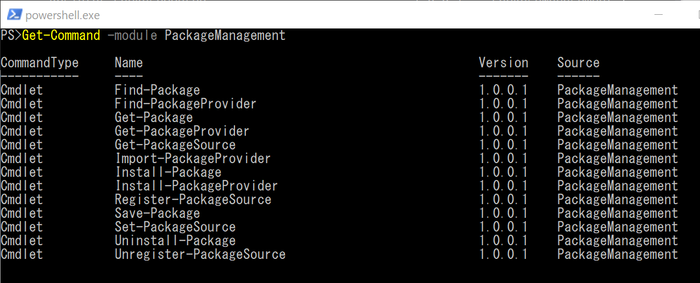

### 🔰PackageManagementで使えるパッケージプロバイダにNugetがあるか確認

対応しているパッケージプロバイダにNugetがあるかどうか確認（一応）

```Powershell
#利用できるパッケージプロバイダの確認
Find-PackageProvider
```

▶Find-PackageProviderで利用できるパッケージプロバイダの確認  
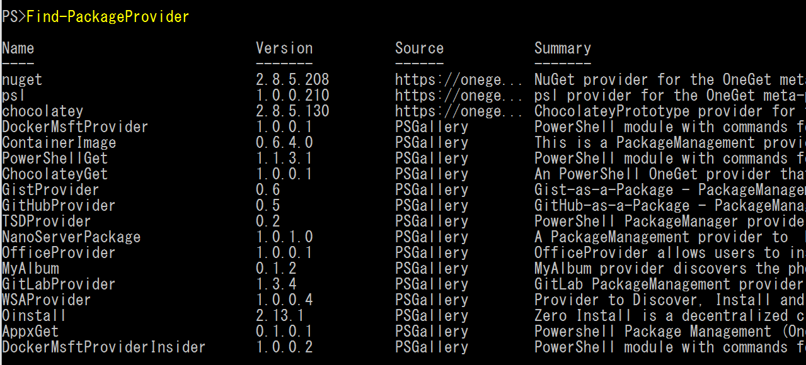

### 🔰PackageManagementに接続されているパッケージプロバイダにNugetが存在するか確認

パッケージプロバイダにNugetが登録されているか確認する。

```Powershell
#ローカルで利用できるパケージプロバイダの確認
Get-PackageProvider
```

▶Get-PackageProviderでインストールされているパッケージプロバイダの確認  
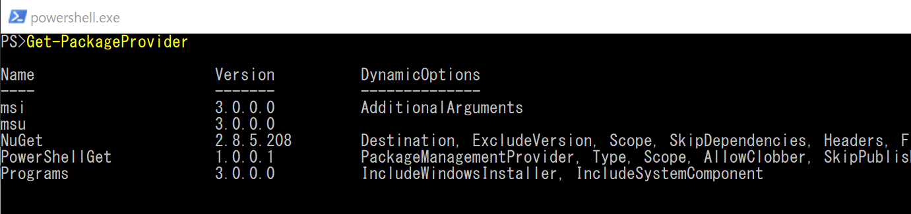

Nugetが登録されていない場合は下記のようにインストールすることができる。

```Powershell
#管理者で実行
Install-PackageProvider -Name Nuget
```

▶パッケージプロバイダのインストール  
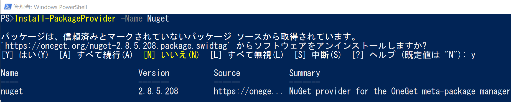

### 🔰インストールしたいパッケージの確認

▶Find-PackageでNugetのClosedXMLを探してみる  
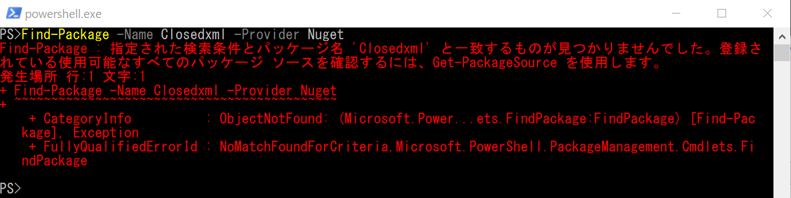

▶なんか見つからない。verboseオプションをつけて詳細をみてみる。  
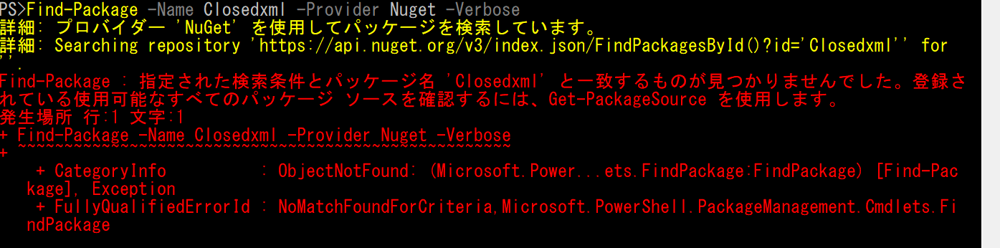

> `詳細: プロバイダー 'NuGet' を使用してパッケージを検索しています。`
> `詳細: Searching repository 'https://api.nuget.org/v3/index.json/FindPackagesById()?id='closedxml'' for ''.`

？？？

▶Get-PackageProviderとGet-PackageSourceをみてみる。  
Nugetのバージョンは2.8.5.208となっているが、Searching repositoryで見に行ってるのはV3の`https://api.nuget.org/v3/index.json`  


なんか調べてみると、VSとPowershellで設定が競合していると言ってる人がいる。  
[Nuget settings conflict between Powershell and VS #4975](https://github.com/NuGet/Home/issues/4975)

Set-PackageSourceでnuget.orgを`https://www.nuget.org/api/v2`にすればPackageManagementが動くようになるけれどVS2015のNugetがぶっこわれるらしい。

▶それもどうなんだという感じなのでfind-packageのsourceオプションで`https://www.nuget.org/api/v2`を付けて動かしてみる。  
パッケージがありました。  
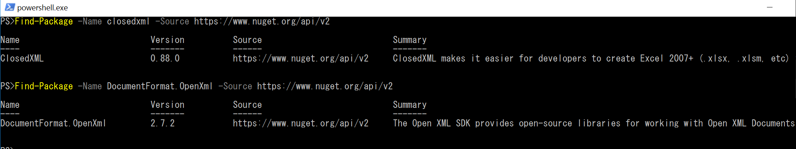

### 🔰パッケージのインストール

Find-Packageで検索して、パイプラインでInstall-Packageに渡してインストール

```Powershell
#管理者で実行
#Find-packageでOpenXmlとclosedxmlを検索して、install-Packageに引き渡す
Find-Package -Name DocumentFormat.OpenXml -Source https://www.nuget.org/api/v2 | Install-Package
Find-Package -Name closedxml -Source https://www.nuget.org/api/v2 | Install-Package
```

▶OpenXmlをインストール  
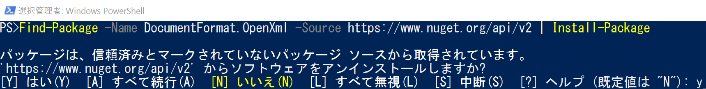

▶Closedxmlをインストール  
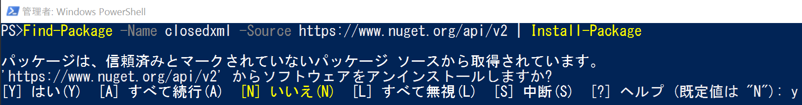

▶get-packageでインストールされたのを確認  


## 🔰ClosedXMLでファイルを作成してみる

使い方については

- [ClosedXML - wiki](https://github.com/ClosedXML/ClosedXML/wiki)

にサンプルとか出来ること出来ない事などなど情報が色々とあります。

とりあえずHelloWorld的な事をやってみる。
helloworldと記載されたxlsxを作成する。

```Powershell
#DLLを読み込む。該当バージョンのClosedXMLはDocumentFormat.OpenXml.dllとFastMember.Signed.dllに依存関係があるので一緒に読み込む。
add-type -path "C:\Program Files\PackageManagement\NuGet\Packages\DocumentFormat.OpenXml.2.7.2\lib\net46\DocumentFormat.OpenXml.dll"
add-type -path "C:\Program Files\PackageManagement\NuGet\Packages\ClosedXML.0.88.0\lib\net452\ClosedXML.dll"
add-type -path "C:\Program Files\PackageManagement\NuGet\Packages\FastMember.Signed.1.1.0\lib\net40\FastMember.Signed.dll"

$workBook = new-object ClosedXML.Excel.XLWorkbook
$workSheet = $workBook.Worksheets.Add("Sheet1")
$worksheet.Cell("A1").Value = "Hello world";
$workBook.SaveAs("c:\temp\helloworld.xlsx")
```

▶上記コマンドで作成されたxlsxファイル  
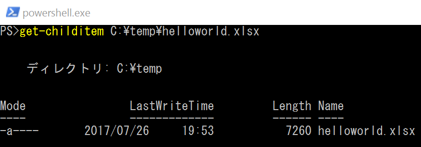

▶上記コマンドで作成されたxlsxファイルの中身  
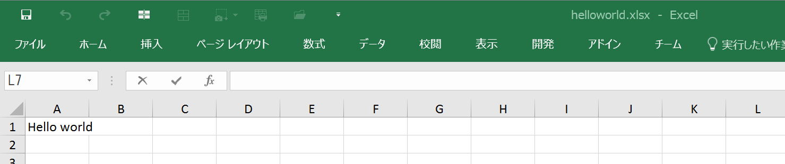

## 🔰ClosedXMLでファイルを読み込んで編集してみる

xlsxファイルを読み込み、読み込んだファイルを編集してみる。

先程作成したhelloworld.xlsxが読み込まれ、B1セルにPowershellのバージョン情報を記載して保存する。

```Powershell

#DLLを読み込む。該当バージョンのClosedXMLはDocumentFormat.OpenXml.dllとFastMember.Signed.dllに依存関係があるので一緒に読み込む。
add-type -path "C:\Program Files\PackageManagement\NuGet\Packages\DocumentFormat.OpenXml.2.7.2\lib\net46\DocumentFormat.OpenXml.dll"
add-type -path "C:\Program Files\PackageManagement\NuGet\Packages\ClosedXML.0.88.0\lib\net452\ClosedXML.dll"
add-type -path "C:\Program Files\PackageManagement\NuGet\Packages\FastMember.Signed.1.1.0\lib\net40\FastMember.Signed.dll"

#先程作成したファイルを読み込む
$workBook = new-object ClosedXML.Excel.XLWorkbook("c:\temp\helloworld.xlsx")
$workSheet = $workBook.Worksheet("Sheet1")

#powershellのバージョン情報をB1セルに書き込む
$worksheet.Cell("B1").Value = $PSVersionTable | out-string

$workBook.SaveAs("c:\temp\helloworld.xlsx")

```

▶上記コマンドを実行して変更されたファイル。  
helloworldの所で生成したファイルに、powershellのバージョン情報が追記された事を確認できる。  
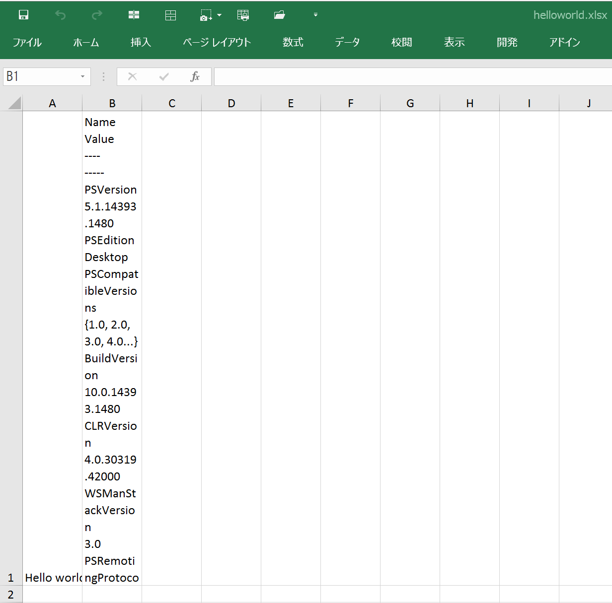

## 🔰セルをRANGEで指定する

```Powershell
#DLLを読み込む。該当バージョンのClosedXMLはDocumentFormat.OpenXml.dllとFastMember.Signed.dllに依存関係があるので一緒に読み込む。
add-type -path "C:\Program Files\PackageManagement\NuGet\Packages\DocumentFormat.OpenXml.2.7.2\lib\net46\DocumentFormat.OpenXml.dll"
add-type -path "C:\Program Files\PackageManagement\NuGet\Packages\ClosedXML.0.88.0\lib\net452\ClosedXML.dll"
add-type -path "C:\Program Files\PackageManagement\NuGet\Packages\FastMember.Signed.1.1.0\lib\net40\FastMember.Signed.dll"

#先程作成したファイルを読み込む
$workBook = new-object ClosedXML.Excel.XLWorkbook("c:\temp\helloworld.xlsx")
$workSheet = $workBook.Worksheet("Sheet1")

#Rangeで範囲指定してセルの値を表示
foreach( $cell in $worksheet.range("A1:B1").cells()){
    write-host $cell.address.tostring() "=" $cell.GetString()
}

```

## 🔰総評

ExcelのCOMオブジェクトをこねこねするよりとても使いやすくてよい。
あとOpenXML+ClosedXMlの組み合わせはexcelがインストールされていない環境でも動くので色々と使いではあるのかもしれない。
